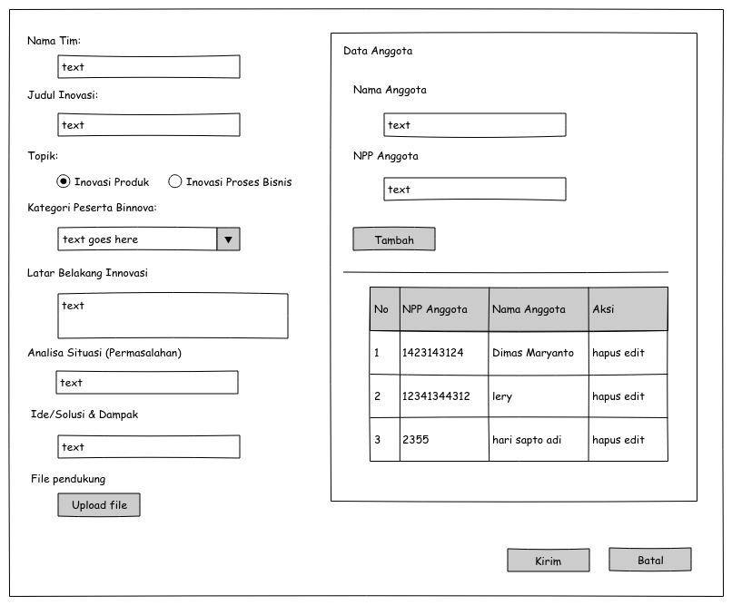
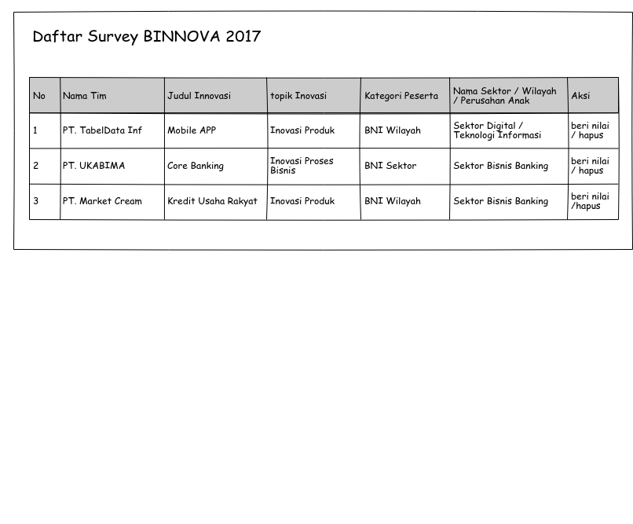
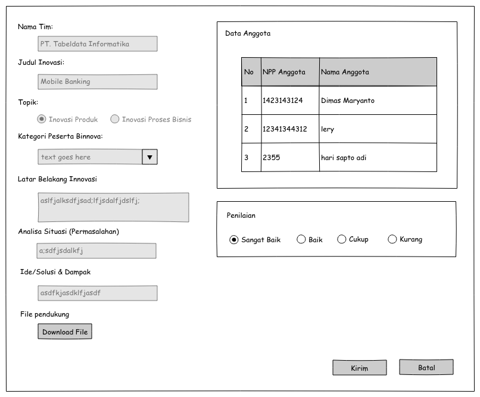

# BNI BISNNOVA 2017

Aplikasi Bisnis Inovation Survey yang dibuat untuk PT. Bank Negara Indonesia (BNI) tentang penilaian bisnis inovation yang terdiri dari group yang memiliki anggota.


## Membuat Aplikasi

### Schema database

```sql 
psql -dimmaryanto93@Aspire-E5:~$ psql -h localhost -U postgres

postgres=# create user bni_bisnnova with login password 'bni_bisnnova'; create database bni_bisnnova with owner bni_bisnnova;
CREATE ROLE
CREATE DATABASE
```

### Function Design Requiredment

* Simpan data penilaiain aplikasi bisnis inovation (BINNOVA 2017)
* Daftar Penilaian
* Daftar Anggota Group

### Design UI

* Form Input data Survey 



* Daftar survey siap dinilai



* Form Penilaian survey



### Security Level

* Admin
* User

